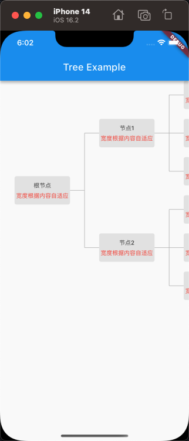
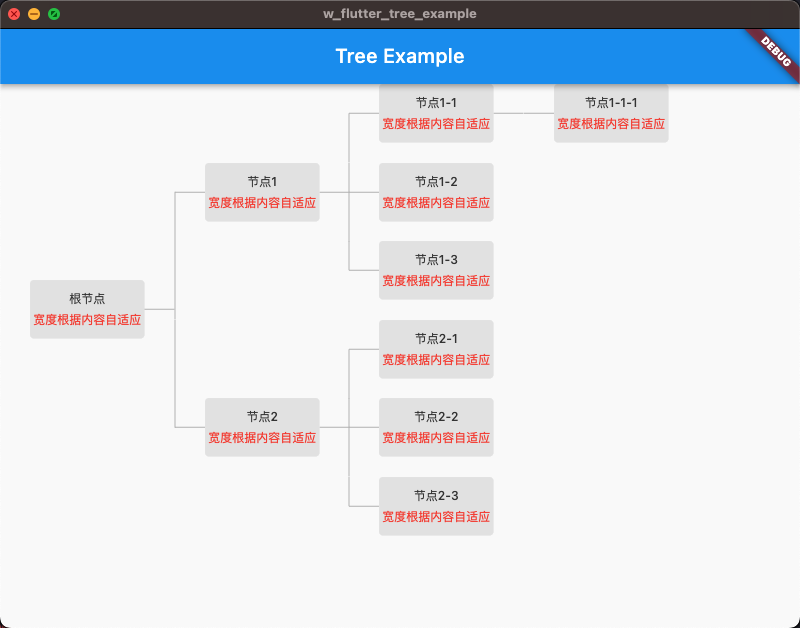

# w_flutter_tree

一个简单的树形图展示库 

## Getting Started

```dart
import 'package:w_flutter_tree/w_flutter_tree.dart';
```

```dart
/// 上下左右滚动
ListView(
          children: [
            SingleChildScrollView(
              scrollDirection: Axis.horizontal,
              physics: const AlwaysScrollableScrollPhysics(),
              child: TreeWidget<TreeModel>(
                style: CustomTreeNodeStyle(),
                node: TreeModel(
                  name: '根节点',
                  trees: [
                    TreeModel(name: '节点1', trees: [
                      TreeModel(
                        name: '节点1-1',
                        trees: [
                          TreeModel(name: '节点1-1-1'),
                        ],
                      ),
                      TreeModel(name: '节点1-2'),
                      TreeModel(name: '节点1-3'),
                    ]),
                    TreeModel(
                      name: '节点2',
                      trees: [
                        TreeModel(name: '节点2-1'),
                        TreeModel(name: '节点2-2'),
                        TreeModel(name: '节点2-3'),
                      ],
                    ),
                  ],
                ),
                builder: (node) {
                  return CustomTreeNodeWidget(data: node);
                },
              ),
            )
          ],
        )
```
### 示例详情见Example

## 树图配置

||可配置|
|--|--|
|strokeColor|✅|
|strokeWidth|✅|
|direction|✅|
|mainAxisLeadingWidth|✅|
|mainAxisTrailingWidth|✅|
|crossAxisSpace|✅|
|自定义画线样式|❌|


## 展示图



